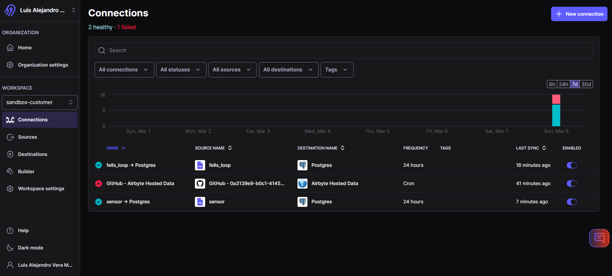
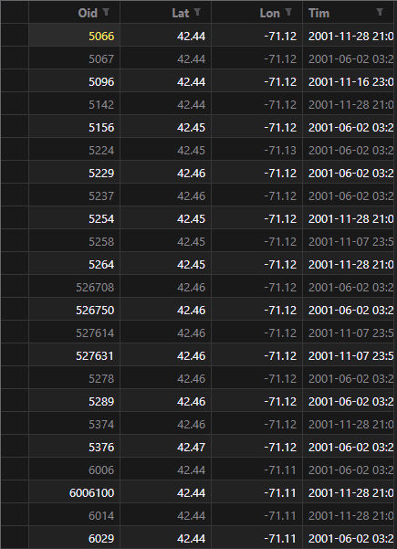
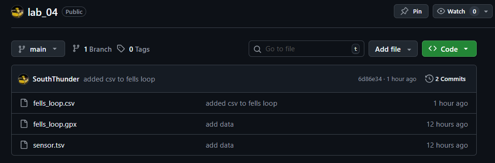
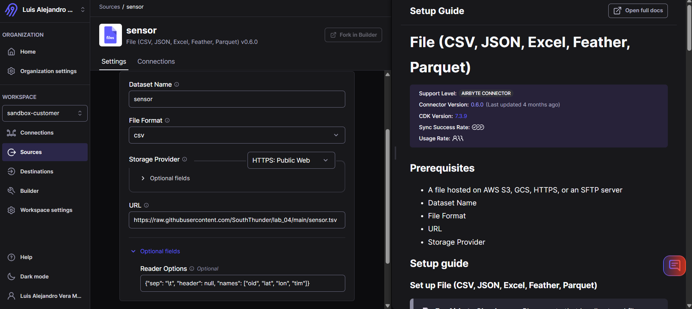
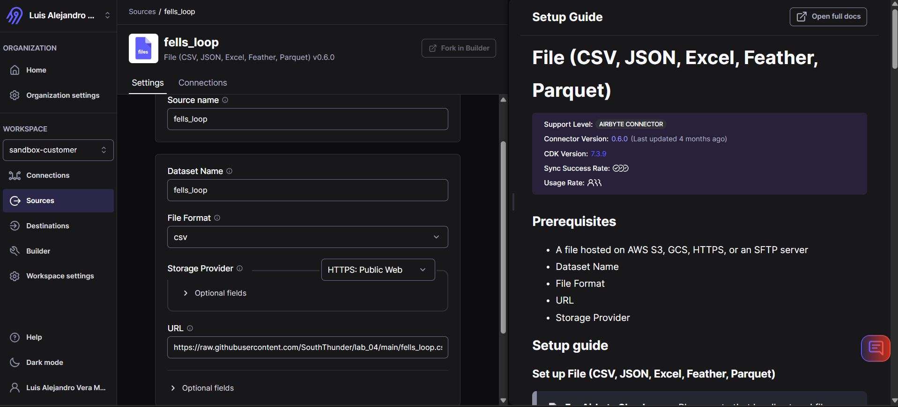
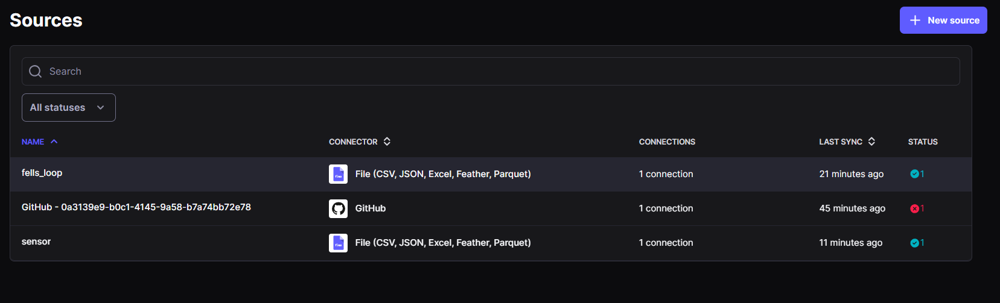
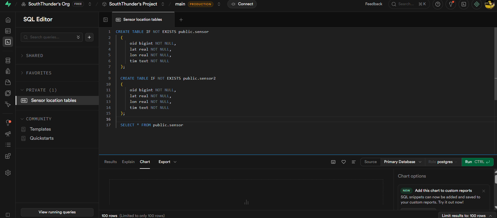
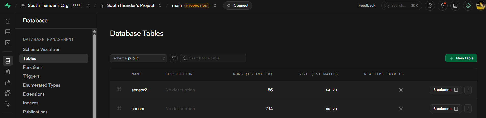

# ETL with Airbyte: A Tutorial Report

## Database Administration — Lab 04 Individual Work

---

## 1. Introduction

This report presents an alternative implementation of the ETL (Extract, Transform, Load) pipeline
described in Lab 04, using **Airbyte** as the data integration tool instead of Pentaho Data Integration (PDI).

Airbyte is an open-source data integration platform that allows users to move data from a wide variety
of sources into destinations through a connector-based architecture. It offers both a self-hosted
deployment and a managed cloud service (Airbyte Cloud), which is what we use in this tutorial.

The goal is to replicate the same ETL workflow: extracting location and sensor data from two
heterogeneous files, transforming the data to match a target schema, and loading the result into
a PostgreSQL database named `sensors` with two tables: `sensor` and `sensor2`.

---

## 2. Tool Overview

| Feature                | Details                                                       |
| ---------------------- | ------------------------------------------------------------- |
| Tool                   | Airbyte Cloud (free tier)                                     |
| URL                    | cloud.airbyte.com                                             |
| Architecture           | Connector-based EL + transformation via dbt or pre-processing |
| Source connectors      | File (CSV, JSON, Excel, Feather, Parquet)                     |
| Destination connectors | PostgreSQL                                                    |
| Transformation support | Basic normalization, dbt models                               |

Airbyte differs from PDI in that it follows an **EL (Extract-Load)** pattern by default, meaning
transformations are typically handled either before ingestion (pre-processing) or after loading
(post-processing via dbt or SQL). This is a common modern data engineering pattern known as ELT.



---

## 3. Data Sources

The same two data sources from the Pentaho lab are used:

### 3.1 GPX File — `fells_loop.gpx`

A GPS Exchange Format file containing **86 waypoints**, each with:

- `oid` — object identifier
- `lat` — latitude
- `lon` — longitude
- `tim` — timestamp in ISO 8601 format (e.g., `2001-11-28T21:05:28Z`)

Airbyte's File connector does not support XML natively, so a pre-processing step is required
to convert this file to CSV format (see Section 4.1).

### 3.2 TSV File — `sensor.tsv`

A tab-separated values file containing **214 sensor records** with the same fields:

- `oid`, `lat`, `lon`, `tim`

Timestamps in this file are already in clean datetime format (`2025-03-02 19:40:33`),
requiring no transformation.

**Total records to load: 300 (86 + 214)**

---

## 4. Data Extraction and Transformation

### 4.1 GPX Pre-processing (Transformation Step)

Since Airbyte cannot read GPX (XML) files directly, we convert `fells_loop.gpx` to CSV using
a Python script. This step is equivalent to the **Get data from XML** step in PDI, combined
with the **Modified JavaScript Value** step that cleaned the timestamp.

```python
import xml.etree.ElementTree as ET
import csv

tree = ET.parse("fells_loop.gpx")
root = tree.getroot()
ns = {"gpx": "http://www.topografix.com/GPX/1/0"}

with open("fells_loop.csv", "w", newline="") as f:
    writer = csv.writer(f)
    writer.writerow(["oid", "lat", "lon", "tim"])
    for wpt in root.findall("gpx:wpt", ns):
        oid = wpt.find("gpx:oid", ns).text
        lat = wpt.get("lat")
        lon = wpt.get("lon")
        tim = wpt.find("gpx:time", ns).text.replace("T", " ").replace("Z", "")
        writer.writerow([oid, lat, lon, tim])
```

This script:

1. Parses the GPX XML structure using XPath (equivalent to PDI's `//wpt` loop XPath)
2. Extracts `oid`, `lat`, `lon`, and `tim` from each waypoint
3. Cleans the timestamp by replacing `T` with a space and removing the trailing `Z`
   (equivalent to the JavaScript transformation: `tim.getString().replace("T", " ")`)
4. Outputs a standard CSV file with a header row



Both files are then pushed to a **public GitHub repository** so Airbyte Cloud can access them
via raw URLs:

- `https://raw.githubusercontent.com/SouthThunder/lab_04/main/sensor.tsv`
- `https://raw.githubusercontent.com/SouthThunder/lab_04/main/fells_loop.csv`



---

## 5. Airbyte Setup

### 5.1 Creating an Airbyte Cloud Account

1. Go to **cloud.airbyte.com** and sign up for a free account
2. A default workspace is created automatically upon login

### 5.2 Setting Up Sources

Two File source connectors are created, one per data file.

#### Source 1 — sensor.tsv

1. Go to **Sources → + New Source**
2. Search for **"File (CSV JSON, Excel, Feather, Parquet)"**
3. Configure:
   - **Source name:** `sensor`
   - **URL:** `https://raw.githubusercontent.com/SouthThunder/lab_04/main/sensor.tsv`
   - **File format:** `csv`
   - **Reader options:** `{"sep": "\t"}` (tab delimiter for TSV)
   - **Dataset name:** `sensor2`
4. Click **Set up source** — the connector validates and accesses the file successfully



#### Source 2 — fells_loop.csv

1. Go to **Sources → + New Source**
2. Search for **"File (CSV JSON, Excel, Feather, Parquet)"**
3. Configure:
   - **Source name:** `fells_loop`
   - **URL:** `https://raw.githubusercontent.com/SouthThunder/lab_04/main/fells_loop.csv`
   - **File format:** `csv`
   - **Dataset name:** `sensor`
4. Click **Set up source** — the connector validates successfully





### 5.3 Setting Up the Destination

Since Airbyte Cloud is a hosted service, it cannot connect to a local Docker container directly.
A cloud-hosted PostgreSQL instance is used via **Supabase** (free tier).

#### Database Setup in Supabase

Before configuring Airbyte, the target tables are created in Supabase using the SQL Editor:

```sql
CREATE TABLE IF NOT EXISTS public.sensor
(
    oid bigint NOT NULL,
    lat real NOT NULL,
    lon real NOT NULL,
    tim text NOT NULL
);

CREATE TABLE IF NOT EXISTS public.sensor2
(
    oid bigint NOT NULL,
    lat real NOT NULL,
    lon real NOT NULL,
    tim text NOT NULL
);
```



#### Destination Configuration in Airbyte

1. Go to **Destinations → + New Destination**
2. Search for **"PostgreSQL"**
3. Configure using the Supabase **Session Pooler** connection (required for IPv4 compatibility
   on the free tier):
   - **Destination name:** `lab04_supabase`
   - **Host:** `aws-0-us-west-2.pooler.supabase.com`
   - **Port:** `5432`
   - **Database:** `postgres`
   - **Username:** `postgres.<project-id>`
   - **Password:** `<your-password>`
   - **Schema:** `public`
   - **SSL:** enabled
4. Click **Test connection** — connection succeeds


> **Note:** The direct connection endpoint in Supabase's free tier is IPv6-only. Airbyte Cloud
> connects over IPv4, so the Session Pooler endpoint must be used instead.

---

## 6. Data Load

### 6.1 Creating Connections

Two connections are created to link each source to the PostgreSQL destination.

#### Connection 1 — fells_loop → Postgres (sensor table)

1. Go to **Connections → + New Connection**
2. Select source: `fells_loop`
3. Select destination: `lab04_supabase`
4. Configure:
   - **Sync mode:** `Full refresh | Overwrite`
   - **Stream:** `sensor`
5. Save and sync

#### Connection 2 — sensor → Postgres (sensor2 table)

1. Go to **Connections → + New Connection**
2. Select source: `sensor`
3. Select destination: `lab04_supabase`
4. Configure:
   - **Sync mode:** `Full refresh | Overwrite`
   - **Stream:** `sensor2`
5. Save and sync

### 6.2 Running the Syncs

Both connections are triggered manually via the **"Sync now"** button. Airbyte extracts the
data from GitHub, applies basic normalization, and loads it into the target tables in Supabase.

---

## 7. Results

After both syncs complete, the data is verified in Supabase's Table Editor:

**Total records loaded: 300**



---

## 8. Comparison with Pentaho Data Integration

| Aspect            | Pentaho PDI                    | Airbyte                                |
| ----------------- | ------------------------------ | -------------------------------------- |
| Architecture      | ETL (transform in-flight)      | ELT (transform before or after load)   |
| GPX ingestion     | Native XML step with XPath     | Requires pre-processing to CSV         |
| Timestamp fix     | Modified JavaScript Value step | Python pre-processing script           |
| Stream merging    | Append Streams step            | Two separate connections               |
| Destination       | Local PostgreSQL (Docker)      | Cloud PostgreSQL (Supabase)            |
| UI                | Desktop/Web visual designer    | Web-based connector catalog            |
| Local file access | Direct filesystem mount        | Requires remote URL (GitHub, S3, etc.) |
| Setup complexity  | Medium (Docker + JDBC driver)  | Low (cloud, no infrastructure)         |

The key architectural difference is that PDI performs transformations **during** the pipeline
as data flows between steps, while Airbyte handles transformations **outside** the pipeline —
either as a pre-processing step (as done here with Python) or as a post-load dbt model.

---

## 9. Conclusion

Airbyte provides a straightforward, connector-based approach to data integration that is
well-suited for cloud and modern data stack environments. While it requires more upfront
preparation for non-standard file formats like GPX, its web interface, built-in connectors,
and managed cloud option make it accessible without deep infrastructure knowledge.

The complete ETL workflow — extracting from two heterogeneous sources, transforming timestamps,
and loading into a structured PostgreSQL database — was successfully replicated using Airbyte
Cloud as an alternative to Pentaho Data Integration.
